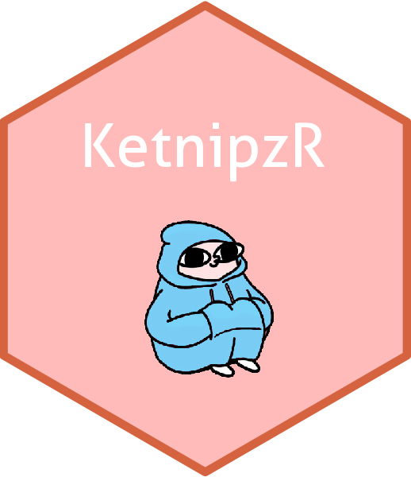

<!-- README.md is generated from README.Rmd. Please edit that file -->

```{r, include = FALSE}
knitr::opts_chunk$set(
  collapse = TRUE,
  comment = "#>",
  fig.path = "man/figures/README-",
  out.width = "100%"
)
```


# KetnipzR  

<!-- badges: start -->

<!-- badges: end -->

The goal of KetnipzR is to ...

## Installation

You can install the development version of KetnipzR from [GitHub](https://github.com/) with:

``` r
# install.packages("devtools")
devtools::install_github("lucassxs/KetnipzR")
```

## Example

This is a basic example which shows you how to solve a common problem:

```{r ketnipzR}
#library(KetnipzR)
# ketnipz_r()
```


In that case, don't forget to commit and push the resulting figure files, so they display on GitHub and CRAN.
